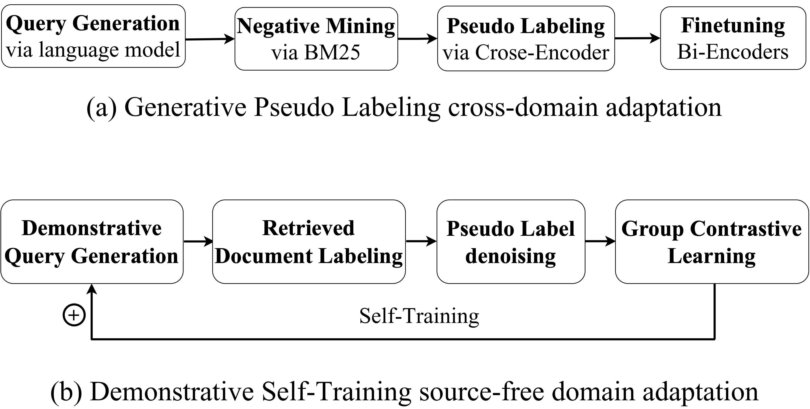

# D-STAR: Demonstrative Self-Training for Source-free Domain Adaptation of Entity Linking with Foundation Models
## Overview
This repository contains the code of D-STAR and [Fandomwiki](https://mega.nz/folder/8KEmnbxK#0QKy0QEK-u9Z84hFogf8dw) dataset to evaluate source-free domain adaptation. In this work, we present D-STAR, a framework for solving unsupervised entity linking problems using Demonstrative Self-Training and source-free domain adaptation. 



*** **UPDATE** ***

We have uploaded comparison of running examples to illustrate our method.

We have uploaded D-STAR query generation scripts with GPT3.5 as the foundation model.

We have uploaded the D-STAR query generation scripts with **[LLaMA](https://mega.nz/folder/0KtV3IpD#b0ZRaOMMsqFsD9y4h2ekAg)** we quantized as the foundation model
## Methods
Our approach utilizes few-shot examples to prompt a foundation model to generate factoid context-relted questions for mention-entity pairs. The order of these examples is determined by a sampled path from a graph encoded by the retriever. We then directly adapt the retrieval model to the generated query and labels retrieved entity documents with its previous knowledge, aided by a pseudo label denoising strategy. Our group contrastive learning strategy shares negative samples within subgraphs. The updated model recomputes distances within the unvisited graph and optimizes the demonstration priority queue for the next self-training cycle. Our demonstrative self-training strategy updates question generation and question answering simultaneously **without accessing source domain data**. 

## Requirements
Our evaluation code is tested on Ubuntu 20.04 with RTX-3090. To install the required packages:
```bash
pip install -r requirements.txt
```
## Data Preparation
download and unzip the [datasets](https://mega.nz/folder/8KEmnbxK#0QKy0QEK-u9Z84hFogf8dw)
```bash
├── data
├── documents
│   ├── american_football.json
│   ├── coronation_street.json
│   ├── doctor_who.json
│   ├── elder_scrolls.json
│   ├── fallout.json
│   ├── final_fantasy.json
│   ├── forgotten_realms.json
│   ├── ice_hockey.json
│   ├── lego.json
│   ├── military.json
│   ├── muppets.json
│   ├── pro_wrestling.json
│   ├── star_trek.json
│   ├── starwars.json
│   ├── world_of_warcraft.json
│   └── yugioh.json
├── entity2mention.json
├── mention2entity.json
├── Fandomwiki
│   ├── mentions
│   │   ├── test.json
│   │   ├── train.json
│   │   └── valid.json
│   └── tfidf_candidates
│       ├── test_tfidfs.json
│       ├── train_tfidfs.json
│       └── valid_tfidfs.json
└── Zeshel
    ├── mentions
    │   ├── all.json
    │   ├── test.json
    │   ├── train.json
    │   └── valid.json
    └── tfidf_candidates
        ├── test_tfidfs.json
        ├── train_tfidfs.json
        └── valid_tfidfs.json
```
download checkpoints

|Name    | Size     | Download Link                                                |
| ------------------ | -------- | ------------------------------------------------------------ |
| bi_encoder (D-STAR)        | 831 MB   | [Result](https://mega.nz/file/wbEBmCJS#1Iol5OVH13W5jxJ5QqflxToaQtYjg-Db34WDJzvtUsg)/[Checkpoint](https://mega.nz/folder/8HMw2KJR#iGgjtjyd0CX92rKs656P5g)       |
| bi_encoder_cand1_group_contrastive_learning   | 831 MB   | [Result](https://mega.nz/file/sKtiXBRJ#Z2kjwipYa3iJEFFzOHJdfrln3UstapRtn_zgYcSWhFs)/[Checkpoint](https://mega.nz/folder/ob8mXYoL#1YXiUlX8RI7NZdrAnvypdA) |
| cross_encoder      | 831 MB   | [Result](https://mega.nz/file/ITlnGTbY#GRXG2l8D3k5fZytlK789FzMpOOgA-V1jnyjQhYs3kP4)/[Checkpoint](https://mega.nz/file/5alGDbAD#aieiMDvoAbC-ULUGfJ6x_ZVFqaAcZfau1ukPgAuWF0E)    |
|ColBERT-v2|406MB|[Checkpoint](https://downloads.cs.stanford.edu/nlp/data/colbert/colbertv2/colbertv2.0.tar.gz)|

Checkpoint structure
```bash
├── bi_encoder_cand1_group_contrastive_learning
│   ├── cross_domain_test_metric.json
│   ├── Fandomwiki_test_metric.json
│   └── model_best.ckpt
├── bi_encoder
│   ├── cross_domain_test_metric.json
│   ├── Fandomwiki_test_metric.json
│   └── model_best.ckpt
├── cross_encoder
│   ├── cross_domain_test_metric.json
│   ├── Fandomwiki_test_metric.json
│   └── model_best.ckpt
```

## Evaluate on Fandomwiki
```bash
bash scripts/eval_fandomwiki.sh
```
## Evaluate on Zeshel
```bash
bash scripts/eval_zeshel.sh
```
## D-STAR query generation
D-STAR query generation using GPT3.5 
```bash
cd colbert
bash scripts/query_generation_chatgpt.sh
```
D-STAR query generation using LLaMA
```bash
cd colbert
bash scripts/query_generation_llama.sh
```
## Self-training (Pseudo Labelling)
```bash
cd colbert
bash scripts/self_training.sh
```
## Group contrastive learning
Run the group contrastive learning with 4~8 GPUs to achieve the similar retrieval performance on Fandomwiki and Zeshel. 
```bash
bash train.sh
```
Run the PEFT version of group contrastive learning on a single GPU with (BitFit \ LoRA \ Adatper \ PromptTuning)!
```bash
bash train_peft.sh
```
## Examples of generated questions
We compare questions generated by random demonstrations and demonstrations from subgraphs to demonstrate diversity.  Although the perplexities can pertain to large model scales as shown in Figure 7, the diversity of questions generated by D-STAR is still in a satisfactory range as evidenced by the following examples.  Compared with randomly sampled demonstrations from other topics or domains, the foundation model better at understanding and generating questions when provided with demonstrations from the same domain. Comparing examples from the same domain, or even further from a subgraph neighborhood, can help to extrapolate question generation for low-overlap mention-entity pairs, which require a higher level of knowledge.
Table 4 Comparison of question generation extrapolation with random demonstrations (grey) and D-STAR on FandomWiki
| Domain | Mention | Matchinig| Question |
| --- | --- | --- |--- |
|Doctor Who|Project FXX Q84|Low|What was the stolen project that Sheldukher used to search for Sakkrat called?|
|Doctor Who|Project FXX Q84|Low|_________________?|
| Doctor Who | Quinn |Medium|Which planet did Quinn end up on?|
| Doctor Who | Quinn |Medium|Which is not true?|
| Doctor Who | Joan Redfern |High|Who did the Doctor give his jacket to after wearing it through several adventures?|
| Doctor Who | Joan Redfern |High|Who was Redfern?|
|Star wars | colleague |Low|Which sephi aide served navi during the clone wars?|
|Star wars | colleague |Low|What?|
|Star wars | attacked |Medium|Where was alderaanian senator bail prestor organa attacked by pirate forces?|
|Star wars | attacked |Medium|Question: Question:?|
|Star wars |Nightbrother|Other|Who was the Nightbrother?|
|Star wars |Nightbrother|Other|Who was maul's brother?|
|Military | Fort Knox|Low|What is the name of the fort that is used as a location in the game?|
|Military | Fort Knox|Low|american forts during 18th and 19th centuries french british and american nations built and|
|Military | Bloody Creek |Medium| What is the significance of the battle of bloody creek?|
|Military | Bloody Creek |Medium| What is the name of the french fort that was built in 1632 to protect acadia from attacks by the wabanaki the french?|
|Military |Springfield rifled musket|Other| What was the name of the primary weapon used by the Union Army during the Civil War?|
|Military |Springfield rifled musket|Other| What was armory's primary weapon of union infantry during war?|
|American Football | UGA | Low| How did the season end when Georgia had won the acc coastal division but lost its last 3 games to its rival uga?|
|American Football | UGA | Low| _________________? |
|American Football |J . T . Thomas|Medium|Which position did J T Thomas play for the Buffalo Bills?|
|American Football |J . T . Thomas|Medium|Question:|
|American Football | Jimmy Graham | High| Who is Jimmy Graham? |
|American Football | Jimmy Graham |High|What is the name of Jimmy Graham? |
|Muppets|Birds - of - a - Feather club|Low|What badge is Maxwell trying to earn with his fellow club members at the Birds-of-a-Feather club?|
|Muppets|Birds - of - a - Feather club|Low|What is scouting?|
|Muppets|Fraggle Rock|Medium|Which character has the most similar view about life?|
|Muppets|Fraggle Rock|Medium|What is Fraggle Rock?|
|Muppets|Orn|High|How long did Orn serve under Crais?|
|Muppets|Orn|High|Who played Orn on farscape episode?|


**Text matching** means the degree of textual overlaps between the mentions and the entities measured by BM25 scores.
## TODO Checklist

- [x] Evaluation scripts uploaded.
- [x] Datasets and checkpoints uploaded.
- [x] D-STAR query generation with GPT3.5.
- [x] D-STAR query generation with LLaMA.
- [x] Self-training scripts.
- [x] Contrastive training scripts.
- [x] General Self-training pipeline.
