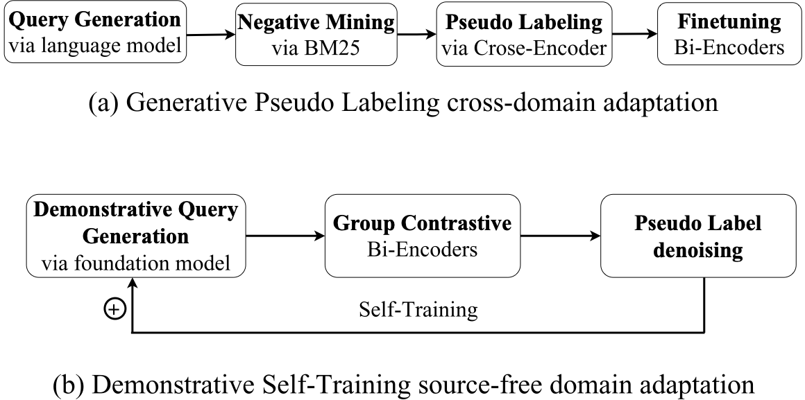
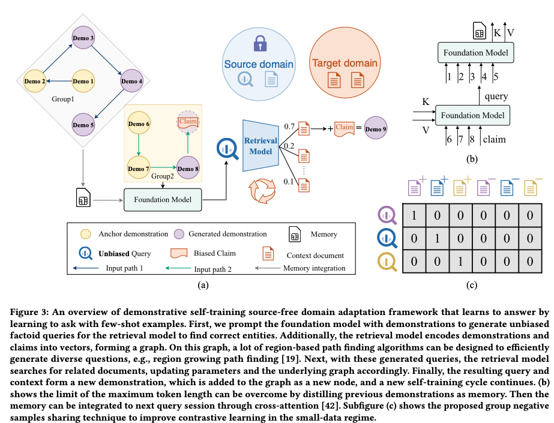

# D-STAR: Demonstrative Self-Training for Source-free Domain Adaptation of Entity Linking with Foundation Models
## Overview
This repository contains the code of D-STAR (ACM MM 2023 submission 2615) and [Fandomwiki](https://mega.nz/folder/8KEmnbxK#0QKy0QEK-u9Z84hFogf8dw) dataset to evaluate source-free domain adaptation. In this work, we present D-STAR, a framework for solving unsupervised entity linking problems using Demonstrative Self-Training and source-free domain adaptation. 



*** **UPDATE** ***

We have uploaded D-STAR query generation scripts with GPT3.5 as the foundation model.

We have uploaded the D-STAR query generation script with [LLaMA](https://mega.nz/folder/0KtV3IpD#b0ZRaOMMsqFsD9y4h2ekAg) as the foundation model
## Methods
Our approach utilizes few-shot examples to prompt a foundation model to generate factoid context-related questions for mention-entity pairs. The order of these examples is determined by a sampled path from a graph encoded by the retriever. We then directly adapt the retrieval model to the generated query and labels retrieved entity documents with its previous knowledge, aided by a pseudo label denoising strategy. Our group contrastive learning strategy shares negative samples within subgraphs. The updated model recomputes distances within the unvisited graph and optimizes the demonstration priority queue for the next self-training cycle. Our demonstrative self-training strategy updates question generation and question answering simultaneously **without accessing source domain data**. 

## Requirements
Our evaluation code is tested on Ubuntu 20.04 with RTX-3090. To install the required packages:
```bash
pip install -r requirements.txt
```
## Data Preparation
download and unzip the [datasets](https://mega.nz/folder/8KEmnbxK#0QKy0QEK-u9Z84hFogf8dw)
```bash
├── data
├── documents
│   ├── american_football.json
│   ├── coronation_street.json
│   ├── doctor_who.json
│   ├── elder_scrolls.json
│   ├── fallout.json
│   ├── final_fantasy.json
│   ├── forgotten_realms.json
│   ├── ice_hockey.json
│   ├── lego.json
│   ├── military.json
│   ├── muppets.json
│   ├── pro_wrestling.json
│   ├── star_trek.json
│   ├── starwars.json
│   ├── world_of_warcraft.json
│   └── yugioh.json
├── entity2mention.json
├── mention2entity.json
├── Fandomwiki
│   ├── mentions
│   │   ├── test.json
│   │   ├── train.json
│   │   └── valid.json
│   └── tfidf_candidates
│       ├── test_tfidfs.json
│       ├── train_tfidfs.json
│       └── valid_tfidfs.json
└── Zeshel
    ├── mentions
    │   ├── all.json
    │   ├── test.json
    │   ├── train.json
    │   └── valid.json
    └── tfidf_candidates
        ├── test_tfidfs.json
        ├── train_tfidfs.json
        └── valid_tfidfs.json
```
download checkpoints

|Name    | Size     | Download Link                                                |
| ------------------ | -------- | ------------------------------------------------------------ |
| bi_encoder (D-STAR)        | 831 MB   | [Result](https://mega.nz/file/wbEBmCJS#1Iol5OVH13W5jxJ5QqflxToaQtYjg-Db34WDJzvtUsg)/[Checkpoint](https://mega.nz/folder/8HMw2KJR#iGgjtjyd0CX92rKs656P5g)       |
| bi_encoder_cand1_group_contrastive_learning   | 831 MB   | [Result](https://mega.nz/file/sKtiXBRJ#Z2kjwipYa3iJEFFzOHJdfrln3UstapRtn_zgYcSWhFs)/[Checkpoint](https://mega.nz/folder/ob8mXYoL#1YXiUlX8RI7NZdrAnvypdA) |
| cross_encoder      | 831 MB   | [Result](https://mega.nz/file/ITlnGTbY#GRXG2l8D3k5fZytlK789FzMpOOgA-V1jnyjQhYs3kP4)/[Checkpoint](https://mega.nz/folder/xKVXhD6Y#74N_WPsMqqXGsc_bx7OlXAr)    |

Checkpoint structure
```bash
├── bi_encoder_cand1_group_contrastive_learning
│   ├── cross_domain_test_metric.json
│   ├── Fandomwiki_test_metric.json
│   └── model_best.ckpt
├── bi_encoder
│   ├── cross_domain_test_metric.json
│   ├── Fandomwiki_test_metric.json
│   └── model_best.ckpt
├── cross_encoder
│   ├── cross_domain_test_metric.json
│   ├── Fandomwiki_test_metric.json
│   └── model_best.ckpt
```

## Evaluate on Fandomwiki
```bash
bash scripts/eval_fandomwiki.sh
```
## Evaluate on Zeshel
```bash
bash scripts/eval_zeshel.sh
```
## D-STAR query generation
D-STAR query generation using GPT3.5 
```bash
cd colbert
bash scripts/query_generation_chatgpt.sh
```
D-STAR query generation using LLaMA
```bash
cd colbert
bash scripts/query_generation_llama.sh
```
## Self-training
```bash
cd colbert
bash scripts/self_training.sh
```

## TODO Checklist

- [x] Evaluation scripts uploaded.
- [x] Datasets and checkpoints uploaded.
- [x] D-STAR query generation with GPT3.5.
- [x] D-STAR query generation with LLaMA.
- [x] Self-training scripts.
- [x] Contrastive training scripts